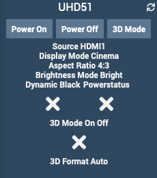

Complemento Optoma
=============

Complemento para controlar los proyectores Optoma a través de Jeedom.

> **Nota**
> Este complemento opera la página web del proyector de video.

**Características:**

- Encender / apagar,
- Visualización de la entrada utilizada,
- Visualización de la cantidad de horas que se ha utilizado la lámpara,

**Modelos compatibles**
- UHD51
- Probablemente otros modelos Optoma

Dashboard
=========

Configuración del complemento
=======================

Después de descargar el complemento, actívelo.

Configuración del equipo
=============================

Se puede acceder a la configuración del equipo desde el menú *Complementos> Multimedia> Optoma Video Projector*.

### Pestaña Equipo:

- **Nombre del VideoProjector**: nombre de su equipo (ex UHD51),
- **Objeto padre**: indica el objeto padre al que pertenece el equipo,
- **Categoría**: las categorías del equipo (puede pertenecer a varias categorías),
- **Activar**: activa su equipo,
- **Visible**: hace que su equipo sea visible en el tablero,
- **Dirección IP**: dirección IP del video proyector.
- **Identificador**: Identificador para conectar al proyector de video
- **Contraseña**: Contraseña asociada con el identificador

### Pestaña de comandos

Los comandos básicos se generan automáticamente.

### Lista de versiones

*[Ver lista de versiones](changelog.md) *
