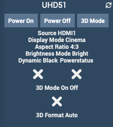

Plugin Optoma
=============

Plugin pour commander les vidéoprojecteurs Optoma via Jeedom.

> **Note**  
> Ce plugin exploite la page web du vidéoprojecteur.

**Fonctionnalités :**

- Allumer / éteindre,
- Affichage de l'éntrée exploitée,
- Affichage du nombre d'heures d'utilisation de la lampe,

**Modèles compatibles**
- UHD51
- Probablement d'autres modèles Optoma

Dashboard
=========

Configuration du plugin
=======================

Après téléchargement du plugin, activer le plugin.

Configuration des équipements
=============================

La configuration des équipements est accessible à partir du menu *Plugins > Multimedia > Optoma Video Projecteur*.

### Onglet Equipement:

-   **Nom du VidéoProjecteur** : nom de votre équipement (ex UHD51),
-   **Objet parent** : indique l’objet parent auquel appartient l’équipement,
-   **Catégorie** : les catégories de l’équipement (il peut appartenir à plusieurs catégories),
-   **Activer** : permet de rendre votre équipement actif,
-   **Visible** : rend votre équipement visible sur le dashboard,
-   **Adresse IP** : Adresse IP du vidéoprojecteur.
-   **Identifiant** : Identifiant pour se connecter au vidéoprojecteur
-   **Mot de passe** : Mot de passe associé à l'identifiant

### Onglet Commandes

Les commandes de bases sont générées automatiquement 

### Liste des versions

*[Voir la liste des versions](changelog.md)*
